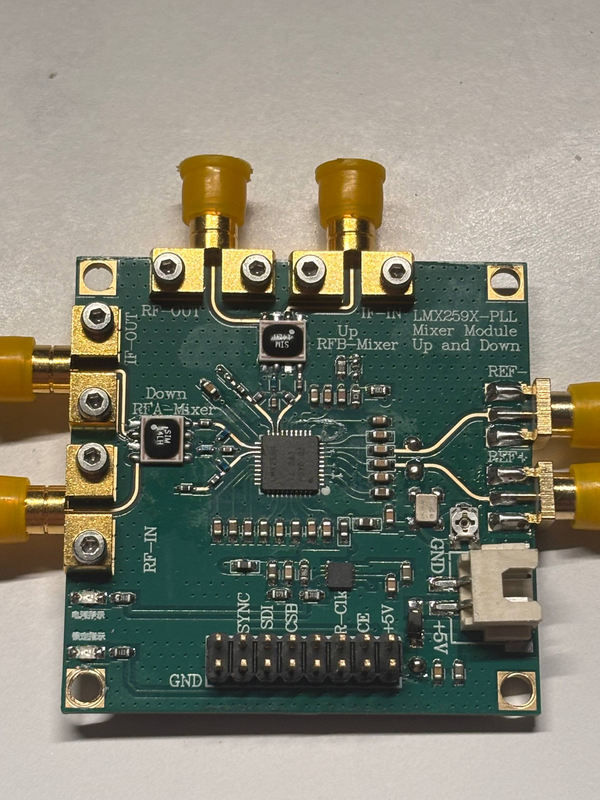
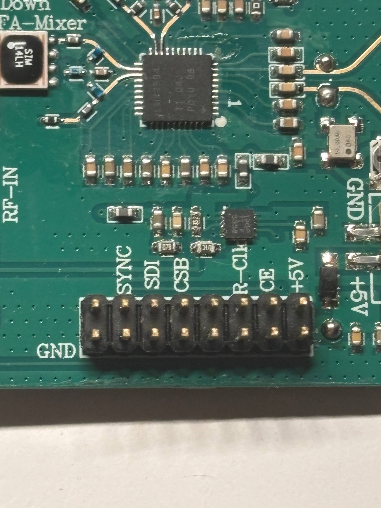
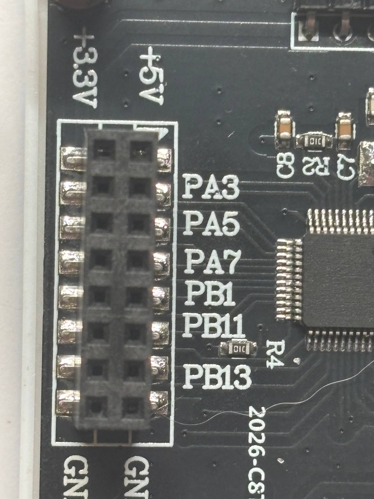
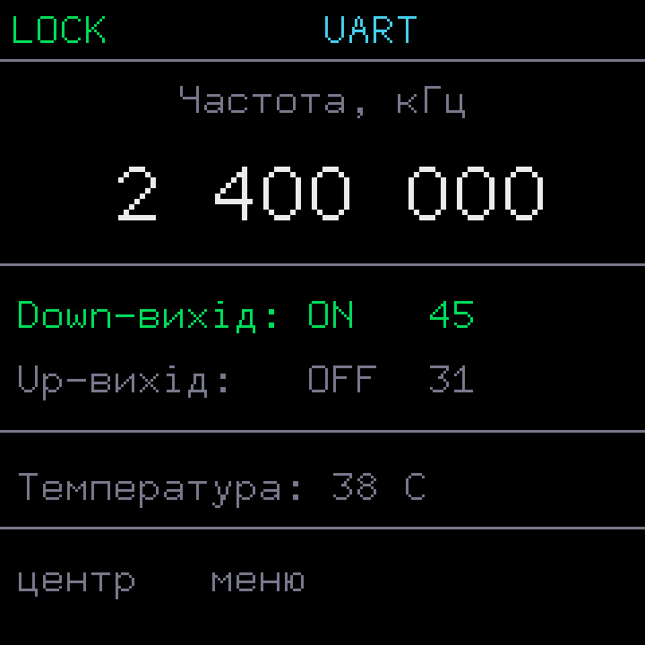
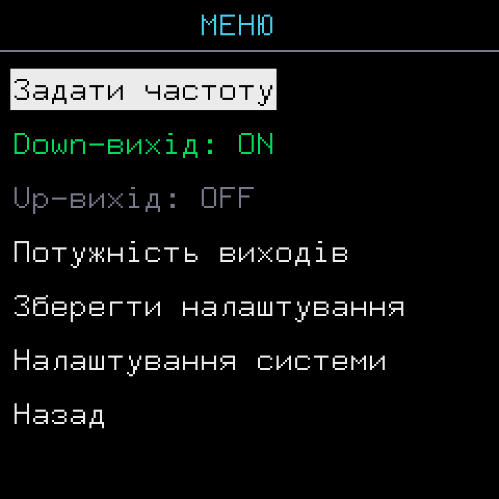
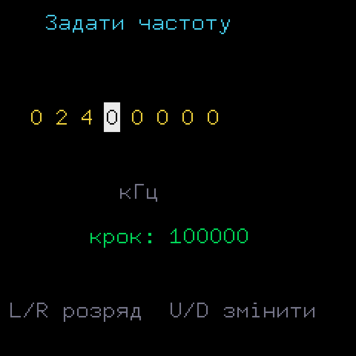
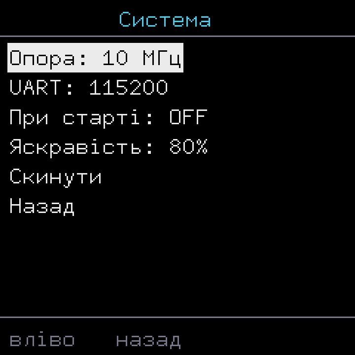

# LMX2594-PLL — реверс і нова прошивка

Відкрита прошивка для китайського модуля **LMX259X-PLL Mixer Module (Up & Down)** —
генератора/гетеродина на синтезаторі частоти **TI LMX2594** (20 МГц – 15 ГГц) з керуванням
на **STM32F103C8T6**. Стокова прошивка — сира альфа з критичними багами; цей проєкт —
повний реверс-інжиніринг оригіналу та написана з нуля стабільна заміна.

Модуль: [Alibaba — 10G Frequency Mixer Module LMX2594 PLL](https://www.alibaba.com/product-detail/10G-Frequency-Mixer-Module-LMX2594-PLL_1601842504526.html)



## Що це за пристрій

Конвертер частоти, де LMX2594 працює як гетеродин (LO). Один LO живить два пасивні
мікшери SIM-153 на **одній частоті**:

- **Down-конвертер** (вихід OUTA): RF-вхід 3.4–15 ГГц × LO → IF DC–4 ГГц
- **Up-конвертер** (вихід OUTB): LF-вхід DC–4 ГГц × LO → RF 3.4–15 ГГц

Керування: локально (дисплей ST7789 + 5 кнопок) або по TTL-UART / USB-CDC.

## Головна проблема стокової прошивки

Модуль **сильно грівся у спокої**. Причина (доведено реверсом): LMX2594 ніколи не
переводився у знижене споживання — VCO+PLL постійно тягли ~250–300 мА. Вимкнення лише
вихідних буферів (як радять типові «фікси») **не допомагає** — гріє саме VCO/PLL, а не виходи.
Правильне рішення — `R0 POWERDOWN` + `CE`, реалізоване тут.

## Що зроблено

### Реверс-інжиніринг стокової прошивки
- Повна розпіновка STM32→LMX2594 (усі 9 сигналів хедера), звірена з фото плати і datasheet
- Повна таблиця регістрів LMX2594 R0–R112 + декод бітових полів
- Частотна математика (PFD 50 МГц, CHDIV-драбина, N/FRAC)
- Знайдено 9 підтверджених багів альфа-прошивки (перегрів, неробочий UART RX, зламаний sweep, тощо)
- Артефакти реверсу — у `re/` та `docs/`

### Нова прошивка (`fw/`)
Bare-metal CMSIS, cooperative superloop, ~26 КБ flash. Виправлено всі баги:

| Функція | Реалізація |
|---|---|
| Термоконтроль | обидва виходи OFF → `R0 POWERDOWN` (чип холодний). Дефолт при старті — усе вимкнено |
| Незалежні виходи | Down (OUTA) / Up (OUTB) вмикаються окремо |
| Ліміт потужності | OUTx_PWR апаратно обмежено до 40 (насичення драйвера за TI + безпека SDR-фронтенду) |
| Частота LO | 20 МГц–15 ГГц, крок 1 кГц, VCO-direct >7.5 ГГц; math перевірена golden-тестом (0 кГц похибки) |
| Lock detect | читання MUXout (PB10) |
| Дисплей | ST7789 240×240, шрифт 9×18 pixel-perfect, українська |
| Ввід | 5 кнопок, дворівневе меню |
| Керування | UART (USART1) + USB-CDC, ті самі команди що стокова (start/stop/w1..wv) + нові |
| Збереження | параметри у flash (journaling + CRC) |

## Розпіновка (STM32F103C8T6, LQFP48)

| Сигнал LMX2594 | STM32 | pin | Використання |
|---|---|---|---|
| CE | PA3 | 11 | chip enable + термоконтроль |
| RampDir | PA4 | 14 | не використовується |
| RampCLK | PA5 | 15 | не використовується |
| SysRefReq | PB0 | 18 | не використовується |
| CSB (CS/LE) | PB1 | 17 | SPI latch |
| MUXout | PB10 | 21 | lock detect |
| SDI (DATA) | PB11 | 22 | SPI MOSI |
| SCK | PB12 | 43 | SPI clock |
| SYNC | PB13 | 44 | не використовується |

Дисплей ST7789: PB5/PB6/PB7/PB8. Кнопки: PA0/PA1/PA2/PA8 + PB15. UART: PA9(TX)/PA10(RX).
Опорна: 10 МГц TCXO, внутрішній множник ×5 → PFD 50 МГц.




## Екрани

| Головний | Меню | Задати частоту | Система |
|---|---|---|---|
|  |  |  |  |

Навігація: **вгору/вниз** — вибір, **вліво/вправо** — змінити/розряд, **центр** — увійти/дія, **вліво** — назад.

## Команди CLI (UART 115200 8N1, USB-CDC), CRLF

Сумісні зі стоковими + нові:

| Команда | Дія |
|---|---|
| `wf<8 цифр>` | задати частоту LO (кГц) |
| `wa1` / `wa0` | Down-вихід (OUTA) увімк/вимк |
| `wb1` / `wb0` | Up-вихід (OUTB) увімк/вимк |
| `pa<2>` / `pb<2>` | потужність OUTA / OUTB (0–40, вище — клемп) |
| `?` | статус |
| `s` | зберегти у flash |
| `w1/w2/w3/wt/wv`, `start`, `stop` | легасі sweep (сумісність) |

## ⚠️ Безпека при подачі на SDR

Вихід LMX2594 на низьких частотах сягає **~+9 дБм** (виміри TI, резисторний pull-up).
Це небезпечно для приймачів: HackRF безпечний лише до −5 дБм, RTL-SDR/Airspy до +10 дБм.

- Прошивка обмежує OUTx_PWR до **40** (вище — насичення драйвера, приросту немає; заодно безпечніше).
- **Атенюатор 20–30 дБ (SMA) між виходом і SDR — обов'язковий.** Софт-ліміт його не замінює.
- Виходи за замовчуванням вимкнені (холодний старт), нарощуй потужність вручну.

Детальні таблиці потужності по частотах — [docs/output-power.md](docs/output-power.md).

## Збірка та прошивка

Потрібен [PlatformIO](https://platformio.org/) + ST-Link.

```sh
cd fw
pio run              # збірка
pio run -t upload    # прошивка через ST-Link
```

Стокову прошивку збережено в `firmware/firmware.bin` (для відкату).

## Структура

```
fw/            нова прошивка (CMSIS, PlatformIO)
firmware/      дамп стокової прошивки
re/            артефакти реверсу, golden-тести, генератор шрифту/макетів
docs/          фото плати, скріни UI
```

## Статус

Працює на залізі: дисплей, меню, кнопки, керування частотою/виходами, термоконтроль
(перегрів усунено), температура MCU. Bring-up триває: timing bit-bang, USB-CDC, точний рівень виходів.
